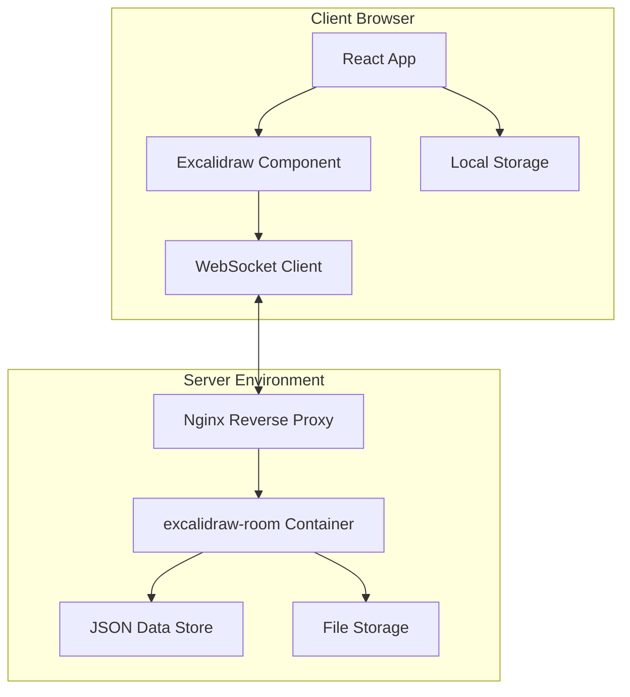

# ADR-0004: アーキテクチャ概要設計

## ステータス
承認済み

## コンテキスト
タスク01の調査結果を基に、excalidraw-boardプロジェクトのシステム全体アーキテクチャを設計する。ローカルネットワーク環境でのセルフホスティングと、公式Excalidrawとの互換性を重視した設計とする。

## システム全体構成

### 高レベルアーキテクチャ



### コンポーネント詳細

#### フロントエンド層
- **React App**: メインアプリケーション
- **Excalidraw Component**: 描画エンジン
- **WebSocket Client**: リアルタイム通信
- **Local Storage**: クライアントサイド永続化

#### サーバー層
- **Nginx**: リバースプロキシ・静的ファイル配信
- **excalidraw-room**: WebSocketサーバー（公式）
- **JSON Data Store**: ルームデータ永続化
- **File Storage**: 画像ファイル保存

## ネットワーク構成

### ポート設定
- **Frontend (Nginx)**: 80 (HTTP)
- **Backend (excalidraw-room)**: 内部通信のみ
- **WebSocket**: /socket.io/ パスでプロキシ

### 通信フロー
1. クライアント → Nginx (HTTP/WebSocket)
2. Nginx → excalidraw-room (プロキシ)
3. excalidraw-room → JSON/File Storage (データ永続化)

## デプロイメント構成

### Docker Compose構成
```yaml
services:
  frontend:
    build: ./frontend
    ports: ["80:80"]
    depends_on: [backend]
    
  backend:
    image: excalidraw/excalidraw-room:latest
    volumes: 
      - ./data:/app/data
    environment:
      - DATA_DIR=/app/data
```

### ディレクトリ構造
```
excalidraw-board/
├── frontend/           # React アプリケーション
├── backend/           # Docker設定・データストレージ拡張
├── data/             # 永続化データ
│   ├── rooms/        # ルームデータ (JSON)
│   └── files/        # 画像ファイル
├── nginx/            # Nginx設定
└── docker-compose.yml
```

## 技術スタック

### フロントエンド
- **Framework**: React 18+ with TypeScript
- **State Management**: Jotai (Atomic Design)
- **Drawing Engine**: @excalidraw/excalidraw
- **WebSocket**: socket.io-client
- **Build Tool**: Vite
- **Styling**: CSS Modules + Tailwind CSS

### バックエンド
- **WebSocket Server**: excalidraw-room (公式)
- **Reverse Proxy**: Nginx
- **Data Storage**: JSON files + File System
- **Container**: Docker + Docker Compose

### 開発・テスト
- **Testing**: Playwright (E2E), Vitest (Unit)
- **Code Quality**: ESLint, Prettier, TypeScript
- **Package Manager**: npm

## スケーラビリティ設計

### 水平スケーリング制限
- **単一サーバー構成**: ローカル環境のため
- **ファイルシステム依存**: 分散環境非対応
- **メモリ内データ**: excalidraw-room制限

### 垂直スケーリング対応
- **リソース調整**: CPU・メモリ上限設定
- **データ量制限**: ルーム数・ファイルサイズ制限
- **クリーンアップ**: 古いデータの自動削除

## パフォーマンス設計

### フロントエンド最適化
- **コードスプリッティング**: 遅延ロード
- **メモ化**: React.memo, useMemo
- **仮想化**: 大量要素の描画最適化
- **デバウンス**: WebSocket送信の制御

### バックエンド最適化
- **データ圧縮**: JSON圧縮
- **キャッシュ**: Nginx静的ファイルキャッシュ
- **ファイルIO**: 非同期処理・バッチ処理
- **メモリ管理**: excalidraw-room制限内運用

## セキュリティ設計

### ローカル環境前提
- **HTTPS**: 任意（ローカル証明書）
- **認証**: 簡易ユーザー名のみ
- **CORS**: 同一オリジン制限
- **ファイルアップロード**: サイズ・形式制限

### データ保護
- **データ暗号化**: 簡素化（必要に応じて）
- **アクセス制御**: ローカルネットワーク制限
- **ログ管理**: 個人情報の記録回避

## 決定事項

1. **アーキテクチャパターン**: クライアント・サーバー型
2. **通信方式**: WebSocket (Socket.IO)
3. **状態管理**: Jotai (アトミック設計)
4. **データ永続化**: JSON + ファイルシステム
5. **デプロイ方式**: Docker Compose

## 影響

### 開発への影響
- React + TypeScript の習熟が必要
- Jotai 状態管理の学習コスト
- Docker コンテナ運用の知識

### 運用への影響
- ローカル環境でのセルフホスティング
- データバックアップの手動対応
- スケールアップ時の制限

## 代替案

### 検討した選択肢
1. **Redux Toolkit**: 状態管理 → Jotai採用
2. **Firebase**: データ永続化 → JSON採用
3. **Next.js**: フレームワーク → Vite+React採用
4. **WebRTC**: P2P通信 → WebSocket採用

## 次のステップ

1. フロントエンド詳細設計
2. 通信プロトコル詳細設計
3. データモデル定義
4. 開発環境構築手順書作成