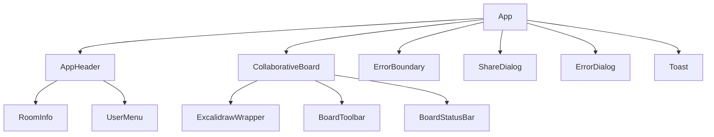

# ADR-0005: フロントエンド設計

## ステータス
承認済み

## コンテキスト
React + TypeScript + Jotaiを基盤とするフロントエンドアーキテクチャの詳細設計を行う。公式Excalidrawの実装パターンを参考に、保守性と拡張性を重視した設計とする。

## ディレクトリ構造

```
frontend/
├── public/
│   ├── index.html
│   └── icons/
├── src/
│   ├── components/           # UIコンポーネント
│   │   ├── Board/           # 描画ボード関連
│   │   │   ├── CollaborativeBoard.tsx
│   │   │   ├── BoardToolbar.tsx
│   │   │   └── BoardStatusBar.tsx
│   │   ├── Header/          # ヘッダー
│   │   │   ├── AppHeader.tsx
│   │   │   ├── RoomInfo.tsx
│   │   │   └── UserMenu.tsx
│   │   ├── Dialog/          # ダイアログ
│   │   │   ├── ShareDialog.tsx
│   │   │   ├── ErrorDialog.tsx
│   │   │   └── ConfirmDialog.tsx
│   │   └── Common/          # 共通コンポーネント
│   │       ├── LoadingSpinner.tsx
│   │       ├── ErrorBoundary.tsx
│   │       └── Toast.tsx
│   ├── hooks/               # カスタムフック
│   │   ├── useCollaboration.ts
│   │   ├── useWebSocket.ts
│   │   ├── useLocalStorage.ts
│   │   └── useExcalidrawState.ts
│   ├── services/            # ビジネスロジック
│   │   ├── websocket.ts
│   │   ├── collaboration.ts
│   │   ├── storage.ts
│   │   └── api.ts
│   ├── stores/              # Jotai状態管理
│   │   ├── atoms/
│   │   │   ├── collaboration.ts
│   │   │   ├── ui.ts
│   │   │   └── excalidraw.ts
│   │   └── index.ts
│   ├── types/               # 型定義
│   │   ├── excalidraw.ts
│   │   ├── collaboration.ts
│   │   └── api.ts
│   ├── utils/               # ユーティリティ
│   │   ├── constants.ts
│   │   ├── helpers.ts
│   │   └── validation.ts
│   ├── styles/              # スタイル
│   │   ├── globals.css
│   │   ├── components.css
│   │   └── variables.css
│   ├── App.tsx
│   ├── main.tsx
│   └── vite-env.d.ts
├── tests/                   # テスト
│   ├── components/
│   ├── hooks/
│   └── utils/
├── package.json
├── vite.config.ts
├── tsconfig.json
└── tailwind.config.js
```

## コンポーネント階層設計

### 主要コンポーネント階層



### コンポーネント責務

#### App.tsx
```typescript
// メインアプリケーションコンポーネント
export function App() {
  return (
    <Provider store={appStore}>
      <ErrorBoundary>
        <div className="app">
          <AppHeader />
          <main className="app-main">
            <CollaborativeBoard />
          </main>
          <GlobalDialogs />
          <Toast />
        </div>
      </ErrorBoundary>
    </Provider>
  );
}
```

#### CollaborativeBoard.tsx
```typescript
// Excalidrawとコラボレーション機能の統合
export function CollaborativeBoard() {
  const { roomId } = useParams();
  const collaboration = useCollaboration(roomId);
  const excalidrawRef = useRef<ExcalidrawImperativeAPI>(null);
  
  return (
    <div className="board-container">
      <Excalidraw
        ref={excalidrawRef}
        onChange={collaboration.handleElementsChange}
        onPointerUpdate={collaboration.handlePointerUpdate}
        // ...other props
      />
      <BoardStatusBar collaboration={collaboration} />
    </div>
  );
}
```

## 状態管理設計 (Jotai)

### Atom構造

#### collaboration.ts
```typescript
// コラボレーション関連の状態
export const roomIdAtom = atom<string | null>(null);
export const isConnectedAtom = atom<boolean>(false);
export const collaboratorsAtom = atom<Collaborator[]>([]);
export const connectionErrorAtom = atom<string | null>(null);

// 派生atom
export const isCollaboratingAtom = atom(
  (get) => get(roomIdAtom) !== null && get(isConnectedAtom)
);
```

#### excalidraw.ts
```typescript
// Excalidraw状態
export const excalidrawElementsAtom = atom<ExcalidrawElement[]>([]);
export const excalidrawAppStateAtom = atom<AppState>({});
export const excalidrawFilesAtom = atom<BinaryFiles>({});

// 複合atom
export const excalidrawSceneAtom = atom(
  (get) => ({
    elements: get(excalidrawElementsAtom),
    appState: get(excalidrawAppStateAtom),
    files: get(excalidrawFilesAtom)
  })
);
```

#### ui.ts
```typescript
// UI状態
export const showShareDialogAtom = atom<boolean>(false);
export const showErrorDialogAtom = atom<boolean>(false);
export const toastMessageAtom = atom<string | null>(null);
export const isLoadingAtom = atom<boolean>(false);
```

### 状態の更新パターン

```typescript
// カスタムフックでの状態更新
export function useCollaboration(roomId: string) {
  const setIsConnected = useSetAtom(isConnectedAtom);
  const setCollaborators = useSetAtom(collaboratorsAtom);
  const setConnectionError = useSetAtom(connectionErrorAtom);
  
  const handleConnect = useCallback(() => {
    setIsConnected(true);
    setConnectionError(null);
  }, []);
  
  return { handleConnect, /* ... */ };
}
```

## ルーティング設計

### ルート構成

```typescript
// React Router設定
const router = createBrowserRouter([
  {
    path: "/",
    element: <App />,
    children: [
      { 
        path: "/", 
        element: <WelcomeScreen /> 
      },
      { 
        path: "/room/:roomId", 
        element: <CollaborativeBoard />,
        loader: roomLoader
      },
      { 
        path: "/create", 
        element: <CreateRoomDialog /> 
      }
    ]
  }
]);
```

### URL設計

- `/` - ウェルカム画面
- `/room/{roomId}` - コラボレーションルーム
- `/create` - 新規ルーム作成
- `#room={roomId},{roomKey}` - 公式互換の共有リンク

## エラーハンドリング設計

### エラー階層

```typescript
// エラー境界の階層設定
<ErrorBoundary fallback={<AppErrorFallback />}>
  <App>
    <ErrorBoundary fallback={<CollaborationErrorFallback />}>
      <CollaborativeBoard />
    </ErrorBoundary>
  </App>
</ErrorBoundary>
```

### エラー型定義

```typescript
// エラー型の分類
export enum ErrorType {
  CONNECTION_ERROR = 'CONNECTION_ERROR',
  SYNC_ERROR = 'SYNC_ERROR',
  FILE_UPLOAD_ERROR = 'FILE_UPLOAD_ERROR',
  VALIDATION_ERROR = 'VALIDATION_ERROR'
}

export interface AppError {
  type: ErrorType;
  message: string;
  details?: any;
  timestamp: number;
}
```

### エラー通知システム

```typescript
// トースト通知でのエラー表示
export function useErrorHandler() {
  const setToast = useSetAtom(toastMessageAtom);
  
  const handleError = useCallback((error: AppError) => {
    const message = getErrorMessage(error);
    setToast(message);
    
    // 重要なエラーはダイアログ表示
    if (error.type === ErrorType.CONNECTION_ERROR) {
      setShowErrorDialog(true);
    }
  }, []);
  
  return { handleError };
}
```

## パフォーマンス最適化

### React最適化

```typescript
// メモ化によるレンダリング最適化
export const BoardToolbar = memo(function BoardToolbar() {
  const tools = useAtomValue(toolsAtom);
  
  return (
    <div className="toolbar">
      {tools.map(tool => (
        <ToolButton key={tool.id} tool={tool} />
      ))}
    </div>
  );
});

// コールバック最適化
export function useCollaborativeHandlers() {
  const syncElements = useAtomValue(syncElementsCallbackAtom);
  
  const handleElementsChange = useCallback((elements: ExcalidrawElement[]) => {
    // デバウンス処理
    debounce(syncElements, 100)(elements);
  }, [syncElements]);
  
  return { handleElementsChange };
}
```

### 遅延読み込み

```typescript
// コンポーネントの遅延読み込み
const ShareDialog = lazy(() => import('./Dialog/ShareDialog'));
const SettingsDialog = lazy(() => import('./Dialog/SettingsDialog'));

// 使用箇所
<Suspense fallback={<LoadingSpinner />}>
  {showShareDialog && <ShareDialog />}
</Suspense>
```

## スタイリング設計

### CSS構成

```css
/* globals.css - グローバルスタイル */
:root {
  --color-primary: #6366f1;
  --color-background: #ffffff;
  --spacing-unit: 8px;
  --border-radius: 6px;
}

/* components.css - コンポーネントスタイル */
.board-container {
  @apply flex-1 relative;
  height: calc(100vh - var(--header-height));
}

.toolbar {
  @apply flex items-center gap-2 p-2 bg-white border-b;
}
```

### Tailwind設定

```javascript
// tailwind.config.js
module.exports = {
  content: ['./src/**/*.{js,ts,jsx,tsx}'],
  theme: {
    extend: {
      colors: {
        primary: 'var(--color-primary)',
        background: 'var(--color-background)'
      }
    }
  }
};
```

## TypeScript設定

### 型定義ストラテジー

```typescript
// 厳密な型チェック
export interface StrictCollaborationState {
  readonly roomId: string | null;
  readonly isConnected: boolean;
  readonly collaborators: readonly Collaborator[];
  readonly lastSyncTime: number | null;
}

// ユーティリティ型の活用
export type CollaborationEvent = 
  | { type: 'connect'; payload: { roomId: string } }
  | { type: 'disconnect'; payload: { reason: string } }
  | { type: 'sync'; payload: { elements: ExcalidrawElement[] } };
```

## 決定事項

1. **状態管理**: Jotai（アトミック設計）
2. **ルーティング**: React Router v6
3. **スタイリング**: Tailwind CSS + CSS Modules
4. **ビルドツール**: Vite
5. **エラーハンドリング**: Error Boundary + Toast通知

## 影響

### 開発効率
- アトミック設計による状態の局所化
- TypeScriptによる型安全性の向上
- ホットリロードによる開発効率向上

### 保守性
- 明確なディレクトリ構造
- 責務分離されたコンポーネント
- 一貫したエラーハンドリング

## 次のステップ

1. 通信設計の詳細化
2. データモデルの定義
3. 開発環境セットアップの準備