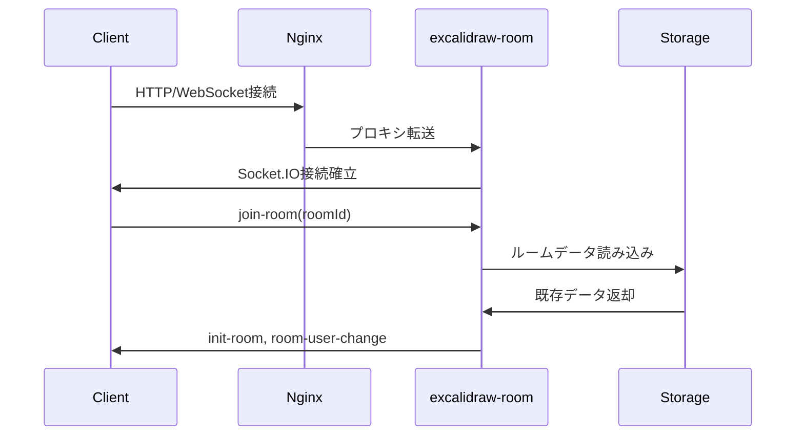

# ADR-0006: 通信設計

## ステータス
承認済み

## コンテキスト
excalidraw-roomとの互換性を保ちながら、効率的なリアルタイム通信を実現するWebSocket通信設計を行う。公式Excalidrawの通信パターンを参考に、ローカル環境に最適化した設計とする。

## WebSocket接続管理

### 接続アーキテクチャ



### 接続設定

```typescript
// WebSocket接続設定
export interface ConnectionConfig {
  url: string;
  transports: ['websocket', 'polling'];
  timeout: number;
  reconnection: boolean;
  reconnectionAttempts: number;
  reconnectionDelay: number;
}

export const defaultConfig: ConnectionConfig = {
  url: process.env.VITE_WEBSOCKET_URL || '/socket.io',
  transports: ['websocket', 'polling'],
  timeout: 5000,
  reconnection: true,
  reconnectionAttempts: 5,
  reconnectionDelay: 1000
};
```

## メッセージプロトコル

### イベント分類

#### クライアント送信イベント
```typescript
export enum ClientEvents {
  // ルーム管理
  JOIN_ROOM = 'join-room',
  LEAVE_ROOM = 'leave-room',
  
  // データ同期
  SCENE_UPDATE = 'scene-update',
  ELEMENTS_UPDATE = 'elements-update',
  
  // リアルタイム情報
  POINTER_UPDATE = 'pointer-update',
  VIEWPORT_UPDATE = 'viewport-update',
  
  // ファイル関連
  FILE_UPLOAD = 'file-upload',
  FILE_REQUEST = 'file-request'
}
```

#### サーバー送信イベント
```typescript
export enum ServerEvents {
  // 接続管理
  CONNECT = 'connect',
  DISCONNECT = 'disconnect',
  
  // ルーム管理
  INIT_ROOM = 'init-room',
  FIRST_IN_ROOM = 'first-in-room',
  ROOM_USER_CHANGE = 'room-user-change',
  NEW_USER = 'new-user',
  USER_LEFT = 'user-left',
  
  // データ同期
  SCENE_BROADCAST = 'scene-broadcast',
  ELEMENTS_BROADCAST = 'elements-broadcast',
  
  // リアルタイム情報
  POINTER_BROADCAST = 'pointer-broadcast',
  VIEWPORT_BROADCAST = 'viewport-broadcast',
  
  // エラー・状態
  ROOM_ERROR = 'room-error',
  SYNC_ERROR = 'sync-error'
}
```

### メッセージフォーマット

#### ルーム参加メッセージ
```typescript
// join-room
interface JoinRoomMessage {
  roomId: string;
  username?: string;
  timestamp: number;
}

// room-user-change
interface RoomUserChangeMessage {
  users: Array<{
    id: string;
    username: string;
    joinedAt: number;
  }>;
  roomId: string;
}
```

#### 要素同期メッセージ
```typescript
// elements-update (送信)
interface ElementsUpdateMessage {
  roomId: string;
  elements: ExcalidrawElement[];
  version: number;
  timestamp: number;
}

// elements-broadcast (受信)
interface ElementsBroadcastMessage {
  senderId: string;
  elements: ExcalidrawElement[];
  version: number;
  timestamp: number;
}
```

#### ポインター共有メッセージ
```typescript
// pointer-update
interface PointerUpdateMessage {
  roomId: string;
  pointer: {
    x: number;
    y: number;
    tool?: string;
    selectedElementIds?: string[];
  };
  username: string;
}
```

## データ同期戦略

### 同期方式

#### 増分同期
```typescript
export class IncrementalSync {
  private lastSyncVersion = 0;
  private pendingChanges: ExcalidrawElement[] = [];
  
  // 変更された要素のみ送信
  syncChanges(elements: ExcalidrawElement[]) {
    const changedElements = elements.filter(
      element => element.version > this.lastSyncVersion
    );
    
    if (changedElements.length > 0) {
      this.sendUpdate(changedElements);
      this.lastSyncVersion = Math.max(...changedElements.map(e => e.version));
    }
  }
  
  // リモート変更の受信・マージ
  receiveChanges(remoteElements: ExcalidrawElement[]) {
    const mergedElements = this.mergeElements(
      this.localElements,
      remoteElements
    );
    
    this.updateLocalElements(mergedElements);
  }
}
```

#### フルシーン同期
```typescript
export class FullSceneSync {
  private readonly FULL_SYNC_INTERVAL = 20000; // 20秒
  
  scheduleFullSync() {
    setInterval(() => {
      if (this.isConnected && this.hasChanges()) {
        this.sendFullScene();
      }
    }, this.FULL_SYNC_INTERVAL);
  }
  
  sendFullScene() {
    const scene = {
      elements: this.getAllElements(),
      appState: this.getAppState(),
      files: this.getFiles()
    };
    
    this.socket.emit('scene-update', {
      roomId: this.roomId,
      scene,
      timestamp: Date.now()
    });
  }
}
```

### 競合解決

#### タイムスタンプベース
```typescript
export function resolveConflict(
  localElement: ExcalidrawElement,
  remoteElement: ExcalidrawElement
): ExcalidrawElement {
  // より新しいタイムスタンプを優先
  if (remoteElement.updated > localElement.updated) {
    return remoteElement;
  }
  
  // 同じタイムスタンプの場合はID順
  if (remoteElement.updated === localElement.updated) {
    return remoteElement.id > localElement.id ? remoteElement : localElement;
  }
  
  return localElement;
}
```

#### 要素マージアルゴリズム
```typescript
export function mergeElements(
  localElements: ExcalidrawElement[],
  remoteElements: ExcalidrawElement[]
): ExcalidrawElement[] {
  const elementMap = new Map<string, ExcalidrawElement>();
  
  // ローカル要素をマップに追加
  localElements.forEach(element => {
    elementMap.set(element.id, element);
  });
  
  // リモート要素で上書き・追加
  remoteElements.forEach(remoteElement => {
    const localElement = elementMap.get(remoteElement.id);
    
    if (!localElement || shouldUseRemoteElement(localElement, remoteElement)) {
      elementMap.set(remoteElement.id, remoteElement);
    }
  });
  
  return Array.from(elementMap.values()).sort((a, b) => a.index - b.index);
}
```

## 再接続ロジック

### 自動再接続

```typescript
export class ReconnectionManager {
  private attempts = 0;
  private readonly maxAttempts = 5;
  private readonly baseDelay = 1000;
  
  async handleDisconnection(reason: string) {
    console.log(`Disconnected: ${reason}`);
    
    if (this.shouldReconnect(reason)) {
      await this.attemptReconnection();
    }
  }
  
  private async attemptReconnection() {
    if (this.attempts >= this.maxAttempts) {
      this.showConnectionError();
      return;
    }
    
    const delay = this.baseDelay * Math.pow(2, this.attempts);
    await this.sleep(delay);
    
    try {
      await this.connect();
      this.attempts = 0; // リセット
    } catch (error) {
      this.attempts++;
      await this.attemptReconnection();
    }
  }
  
  private shouldReconnect(reason: string): boolean {
    // サーバーエラーやネットワークエラーの場合は再接続
    return !['client-disconnect', 'user-logout'].includes(reason);
  }
}
```

### 状態復旧

```typescript
export class StateRecovery {
  private localBackup: ExcalidrawElement[] = [];
  
  // 接続断絶時のローカル保存
  backupState(elements: ExcalidrawElement[]) {
    this.localBackup = JSON.parse(JSON.stringify(elements));
    localStorage.setItem('excalidraw-backup', JSON.stringify(elements));
  }
  
  // 再接続時の状態復旧
  async recoverState(): Promise<ExcalidrawElement[]> {
    try {
      // サーバーから最新状態を取得
      const serverState = await this.fetchServerState();
      
      // ローカルバックアップとマージ
      const mergedState = this.mergeWithBackup(serverState);
      
      return mergedState;
    } catch (error) {
      // サーバー取得に失敗した場合はローカルバックアップを使用
      return this.loadLocalBackup();
    }
  }
}
```

## パフォーマンス最適化

### スロットリング・デバウンス

```typescript
export class MessageThrottling {
  private readonly pointerThrottle = 33; // 30fps
  private readonly elementThrottle = 100; // 10fps
  private readonly sceneDebounce = 300; // 300ms
  
  // ポインター更新のスロットリング
  private throttledPointerUpdate = throttle(
    this.sendPointerUpdate.bind(this),
    this.pointerThrottle
  );
  
  // 要素更新のデバウンス
  private debouncedElementUpdate = debounce(
    this.sendElementUpdate.bind(this),
    this.elementThrottle
  );
  
  // シーン更新のデバウンス
  private debouncedSceneUpdate = debounce(
    this.sendSceneUpdate.bind(this),
    this.sceneDebounce
  );
}
```

### バッチ処理

```typescript
export class BatchProcessor {
  private elementBatch: ExcalidrawElement[] = [];
  private readonly batchSize = 50;
  private readonly batchInterval = 100;
  
  addElement(element: ExcalidrawElement) {
    this.elementBatch.push(element);
    
    if (this.elementBatch.length >= this.batchSize) {
      this.flushBatch();
    }
  }
  
  private scheduleBatchFlush() {
    setTimeout(() => {
      if (this.elementBatch.length > 0) {
        this.flushBatch();
      }
    }, this.batchInterval);
  }
  
  private flushBatch() {
    if (this.elementBatch.length === 0) return;
    
    this.sendElementsBatch(this.elementBatch);
    this.elementBatch = [];
  }
}
```

## エラーハンドリング

### 通信エラー分類

```typescript
export enum CommunicationError {
  CONNECTION_TIMEOUT = 'CONNECTION_TIMEOUT',
  CONNECTION_LOST = 'CONNECTION_LOST',
  ROOM_NOT_FOUND = 'ROOM_NOT_FOUND',
  SYNC_CONFLICT = 'SYNC_CONFLICT',
  MESSAGE_FORMAT_ERROR = 'MESSAGE_FORMAT_ERROR',
  SERVER_ERROR = 'SERVER_ERROR'
}

export interface CommunicationErrorDetails {
  type: CommunicationError;
  message: string;
  timestamp: number;
  metadata?: any;
}
```

### エラー処理戦略

```typescript
export class CommunicationErrorHandler {
  handleError(error: CommunicationErrorDetails) {
    switch (error.type) {
      case CommunicationError.CONNECTION_TIMEOUT:
        this.showRetryDialog();
        break;
        
      case CommunicationError.CONNECTION_LOST:
        this.startReconnection();
        break;
        
      case CommunicationError.SYNC_CONFLICT:
        this.resolveConflictDialog();
        break;
        
      case CommunicationError.ROOM_NOT_FOUND:
        this.redirectToHome();
        break;
        
      default:
        this.showGenericError(error.message);
    }
  }
}
```

## セキュリティ考慮事項

### メッセージ検証

```typescript
export class MessageValidator {
  validateJoinRoom(message: any): message is JoinRoomMessage {
    return (
      typeof message.roomId === 'string' &&
      message.roomId.length <= 64 &&
      /^[a-zA-Z0-9-_]+$/.test(message.roomId)
    );
  }
  
  validateElements(elements: any[]): elements is ExcalidrawElement[] {
    return elements.every(element => 
      this.isValidElement(element)
    );
  }
  
  private isValidElement(element: any): boolean {
    return (
      typeof element.id === 'string' &&
      typeof element.type === 'string' &&
      typeof element.x === 'number' &&
      typeof element.y === 'number'
    );
  }
}
```

## 決定事項

1. **プロトコル**: Socket.IO with custom events
2. **同期方式**: 増分同期 + 定期フル同期
3. **競合解決**: タイムスタンプベース
4. **再接続**: 指数バックオフ付き自動再接続
5. **パフォーマンス**: スロットリング + バッチ処理

## 影響

### 開発への影響
- Socket.IOクライアントライブラリの習熟
- 非同期処理・競合解決の実装
- エラーハンドリングの包括的実装

### パフォーマンスへの影響
- 最適化されたメッセージ送信頻度
- ネットワーク帯域の効率的利用
- クライアント負荷の分散

## 次のステップ

1. データモデルの詳細定義
2. WebSocketサービス実装
3. 統合テスト設計